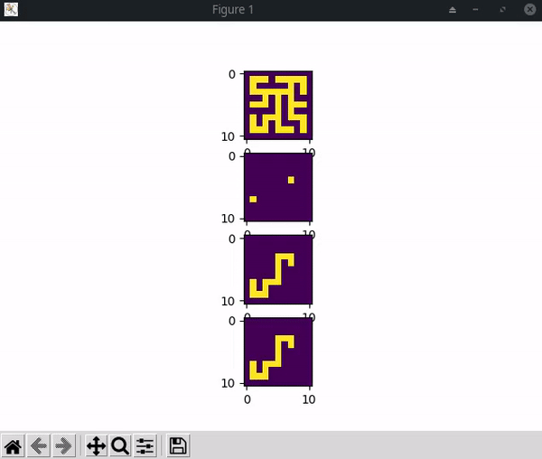
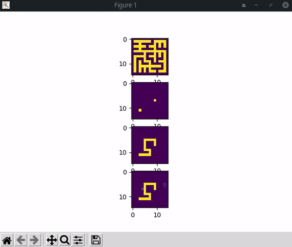
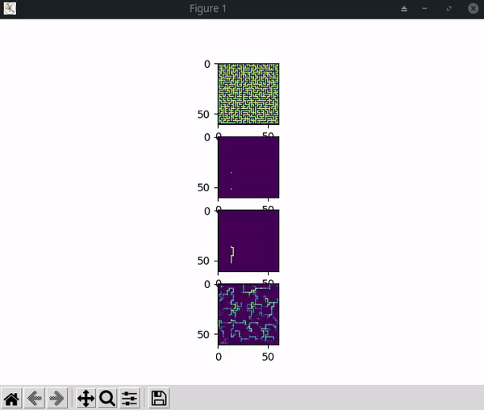

# logical_extrapolation
Code based upon End-to-end Algorithm Synthesis with Recurrent Networks: Logical Extrapolation Without Overthinking (arXiv:2202.05826)
  
trained on 9x9 with at most 30 "thinking/recurrent" steps.
 <h2>9x9 (30 steps)</h2> 

 <h2>13x13 (50 steps)</h2> 

 <h2>59x59 (100 steps)</h2> 

