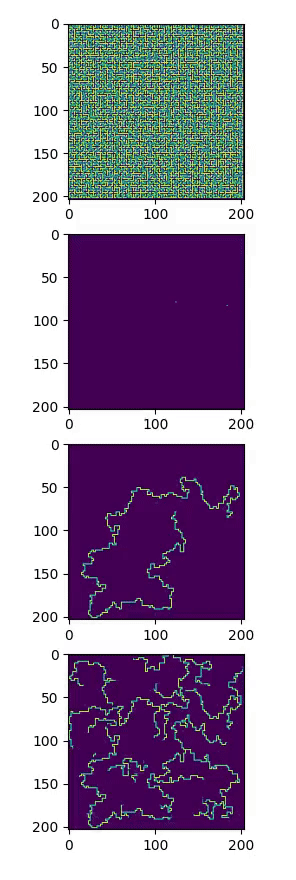
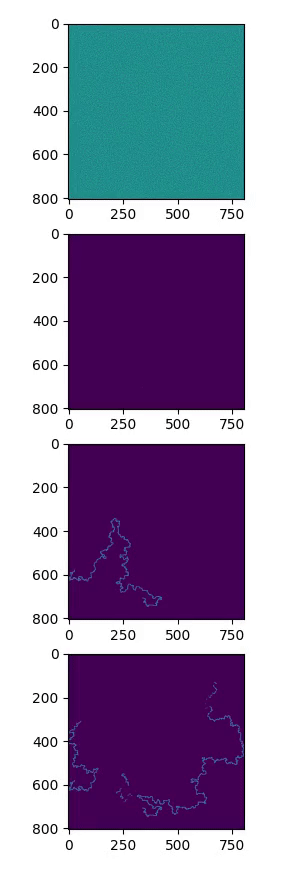

# logical_extrapolation
Code based upon End-to-end Algorithm Synthesis with Recurrent Networks: Logical Extrapolation Without Overthinking (arXiv:2202.05826)
  
Trained on 9x9 with at most 30 "thinking/recurrent" steps.  
Below is the inference on 9x9 (inside the training set) and 13x13, 59x59 (both outside of the training set and using more recurrent steps than during training)
 
first image of each gif is the maze, the second start and goal, third the ground truth, fourth the output of the network at each "thinking" step.
 <h2>9x9 (30 steps)</h2> 

 <h2>13x13 (50 steps)</h2> 

 <h2>59x59 (100 steps)</h2> 

 <h2>201x201 (1000 steps)</h2> 

 <h2>801x801 (7000 steps, the visualization has 100 steps per frame update)</h2> 

